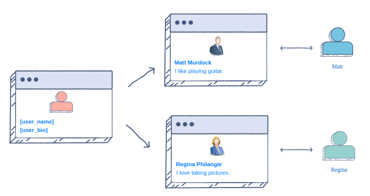

# What are Templates?

Imagine you're building a social media website with multiple user profiles. Instead of creating a separate webpage for each user, you can create a generic template with placeholders for dynamic content. This template can be used to serve different profiles by replacing placeholders with actual user data.

In the example below, **`[user_name]`** and **`[user_bio]`** are placeholders for dynamic user-specific data.

> In Laravel, these placeholders are replaced using Blade syntax, which includes directives, expressions, and control structures.
> 

## Laravel Blade Templates

Laravel provides Blade as its template engine. Blade templates are designed to be familiar to those who know HTML while offering additional features for dynamic content and logic. The Blade syntax includes:

- **Directives**: Blade directives are enclosed within **`@`** symbols and control the template's logic and structure. For example, the **`@if`**, **`@foreach`**, and **`@extends`** directives are commonly used.
- **Expressions**: Blade expressions are enclosed within curly braces **`{}`** and allow you to output dynamic content. For example, **`{{ $user_name }}`** would output the value of the **`$user_name`** variable.
- **Comments**: Blade templates support comments, which are not displayed in the final HTML output.

Below is a simple Blade template illustrating some basic concepts:

```php
@extends('layouts.base_generic')

@section('title', $page->title)

@section('content')
	<h1>{{ $page->title }}</h1>
	
	@foreach ($blog_list as $blog)
	<h2>
	  <a href="{{ $blog->getAbsoluteUrl() }}">
	    {{ strtoupper($blog->header) }}
	  </a>
	</h2>
	<p>{{ Str::limit($blog->body, 100) }}</p>
	@endforeach
@endsection
```
